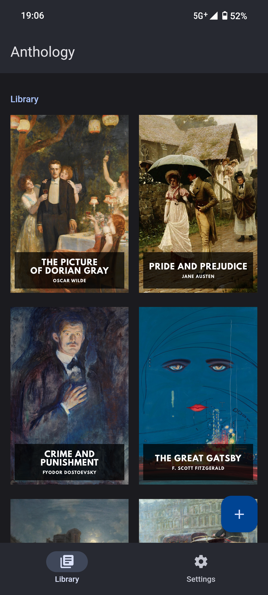

<h1 align="center"><b>Anthology</b></h1>
<h4 align="center">Sleek, fast ebook reader for Android</h4>

## Screenshots

## Powered by

- [Svelte](https://svelte.dev)
- [Capacitor.js](https://capacitorjs.com/)
- [Framework7](https://framework7.io)
- [foliate-js](https://github.com/johnfactotum/foliate-js)
